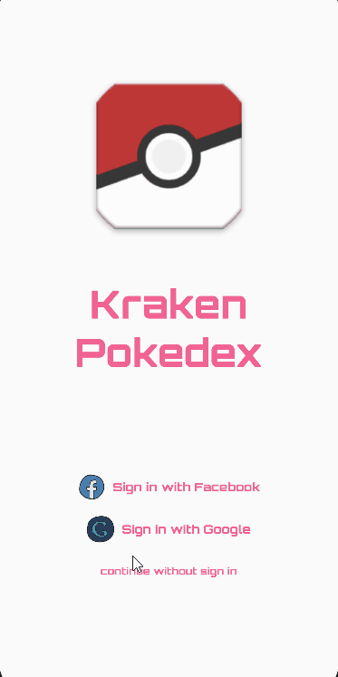

# Kraken Pokedex

## Instructions

* This is an example project for practicing on bloc and testing.
* [PokeApi V2](https://pokeapi.co/) used in the app.

## Completed Tasks
-  **Feature-first** architecture                                    
-  **Facebook Sign-in** for authentication                                              
-  **Google Sign-in** and **Anonymous login** for authentication                         
-  [Bloc](https://www.bloclibrary.dev/) for **State Management**.                       
-  [Chopper](https://www.pub.dev/chopper) for **Network Requests**                         
-  [JSON Serializable](https://www.pub.dev/packages/json_serializable) for **JSON Parsing** 
- Pagination for list screen                                                                     
- Writing Unit tests                                                                              
- Writing Widget tests                                                                         
- Writing Integration tests                                                                     

## App
